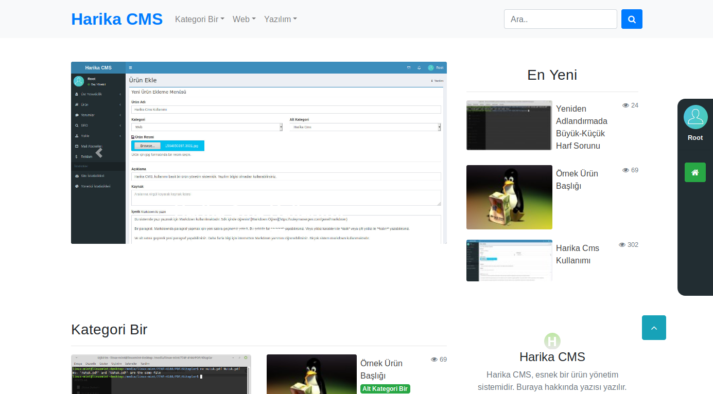
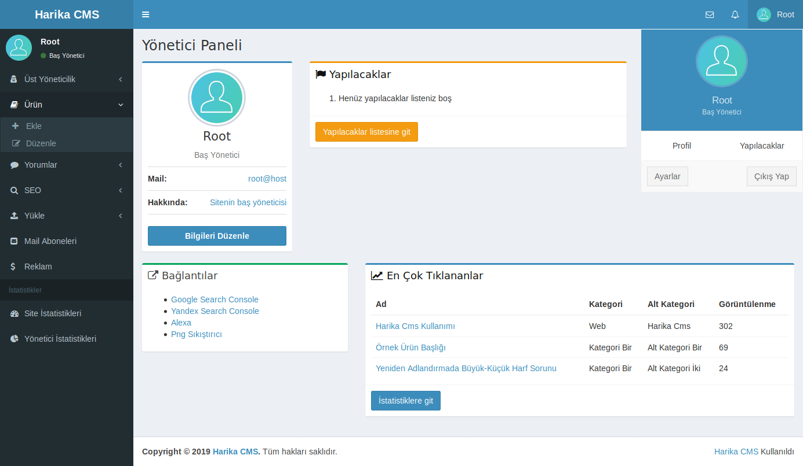
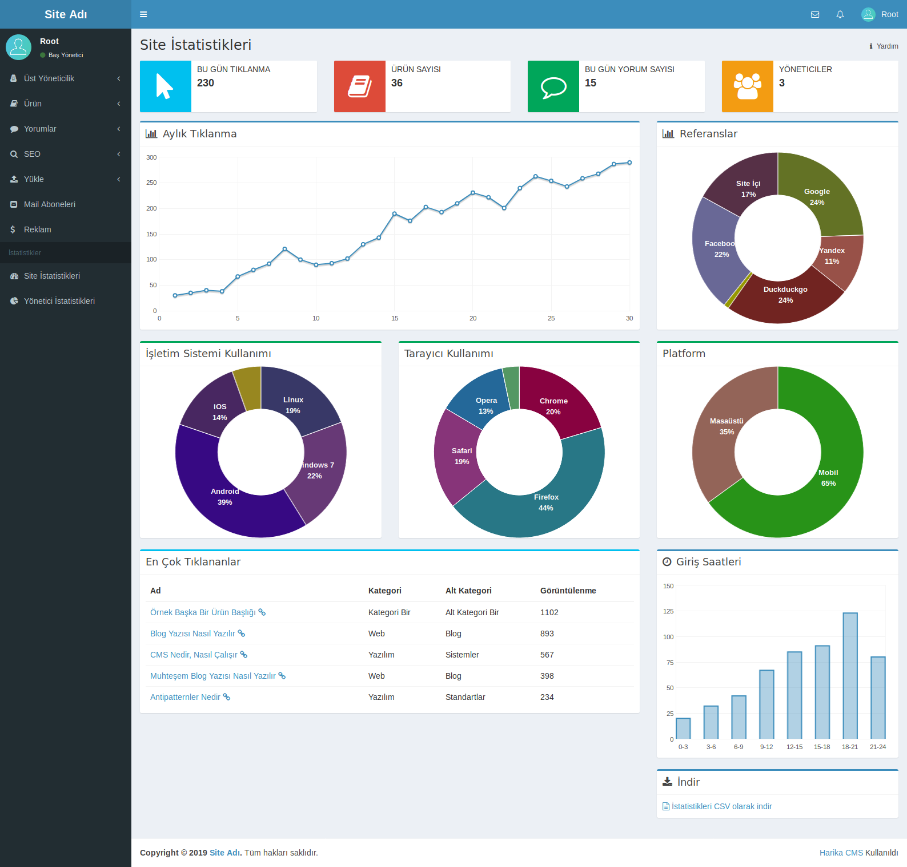

# Harika CMS

Harika CMS, içerik yönetim sistemidir. İndirdiğinizde blog sitesi şeklinde olmakla beraber; küçük uğraşlarla haber sitesine, ürün satış sitesine veya diğer ürün yönetim sitelerine çevrilebilir. Harika bir yönetim paneli vardır.

Kodu sitenize yükleyip kullanmaya başlayabilirsiniz. Kullanımı hafifdir. Kategori ve alt kategoriler halinde ürünlerinizi yönetebilirsiniz. Codeigniter ile yazılmıştır.

## Özellikleri

- Kategori ve alt kategoriler altında ürün yönetimi
- Ürünlere yorum yapabilme
- Sosyal medya paylaşım bağlantıları
- Oldukça hafif
- Bootstrap arayüz
- Tamamen türkçe kodlar ve açıklamaları
- Yazılım bilmeden site kurulumu

**Ayrıca**

- Yüksek güvenlikli giriş
- Çoklu yönetici sistemi
- Yöneticiler arası rütbe ve yönetici yönetimi
- Yöneticiler arası mesajlaşma sistemi
- Önbellekleme ile hızlı sayfalar
- Siteyi yedekleme
- Yorum yönetimi
- Seo ayarları (Robots.txt düzenleme ve site haritası yönetimi)
- Mail aboneleri yönetimi
- Beklenmedik durumlarda bildirimler
- Yapılacaklar (TODO) listesi
- Yönetici istatistikleri
- Site istatistikleri
- Reklam yönetimi (Beta)

## Kurulum

1. İndirdiğiniz kodu sunucunuza atın.
2. "/kur.php" ekranına gidip istenilen bilgileri doldurun.
3. Yönetim paneline "/admin" dizini ile girip istediğiniz düzenlemeleri yapın, ürünleri ekleyin.
4. Siteniz yayınlanmaya hazır olduğunda, seo bölümünden sitenizi taranabilir duruma getirin. Bu Kadar!

## Kullanım

Site kullanımı oldukça basittir. Ayrıca yönetim panelindeki bir sayfada nasıl kullanacağınızı bilmiyorsanız, sağ üstteki yardım yazısına basarak o sayfanın kullanımını öğrenebilirsiniz.

"application/config/site_ayarlar.php"de değişiklik yapabilirsiniz. Kodlarında değişiklik yapmak isterseniz bilgi almak için "docs/gelistirme/" klasörünü okuyabilirsiniz.

### Lisans

Harika CMS, [MIT](http://opensource.org/licenses/MIT) lisansı altında yayımlanmış açık kaynak kodlu bir projedir. Kullanma, kopyalama ve dağıtmada özgürsünüz.
